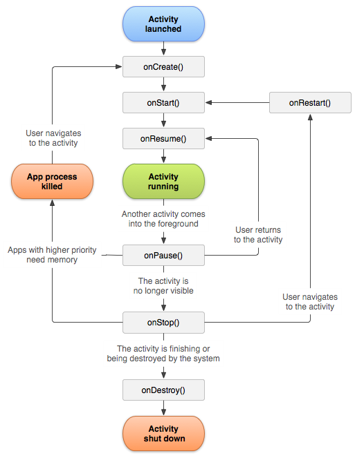
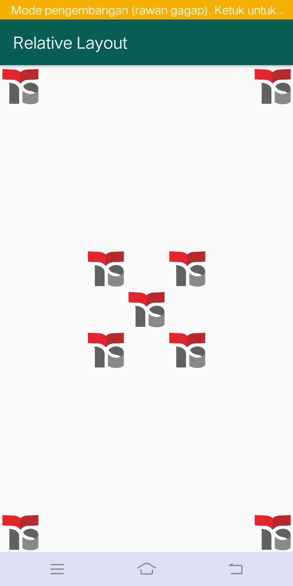

<h2>SOAL PRODUKTIF</h2>
<h5>1. Berikan penjelasan dari perbedaan linear layout, relative layout, dan constrain layout.</h5>
<h5>2. Jelaskan method onCreate dan onPause pada activity.</h5>

<h2>JAWABAN</h2>
<h5>Soal no. 1</h5>
<h5>
  Linear Layout adalah jenis layout dimana user menempatkan 1 objek per baris atau kolom secara sejajar. Jadi di dalam setiap baris atau kolom hanya ada 1 objek yang bisa ditempatkan . Linear Layout ini ada dua jenis . Yaitu :
•	Linear Layout Vertical (Objek per baris/kesamping) 
•	Linear Layout Horizontal (Objek per kolom/kebawah)

  </h5>
<h5>
  Relative Layout adalah jenis layout yang memiliki karakteristik dalam menempatkan view secara relatif. Relatif disini berarti posisi dari setiap view bergantung kepada view yang lain. Simplenya adalah, kita bebas untuk menempatkan objek yang diinginkan sesuka hati kita. Penempatan satu objek bisa dimana saja mau di sisi kanan, kiri, atas, ataupun bawah dari objek lain. Jika tidak di tetapkan, maka objek dapat menumpuk antara satu objek dengan objek yang lain.
  
  </h5>
<h5>
  Constrain Layout memungkinkan kita membuat tata letak yang besar dan kompleks dengan tampilan datar. Ini hampir mirip dengan Relative Layout karena semua tampilan ditata berdasarkan hubungan antara satu objek dengan yang lain, tetapi lebih fleksibel daripada RelativeLayout dan lebih mudah digunakan dengan Editor Layout Android Studio.
  
  </h5>
<h5>
  Dari ketiga layout tersebut maka kita bisa mengambil kesimpulan bahwa setiaplayout memiliki keunggulan dan kekurangan masing-masing, linear layout bisa mengikuti ukuran layar handphone yang berbeda-beda tanpa merubah susuan objek, relative layout hanya akan terlihat sesuai dengan apa yang telah ditetapkan sebelumnya jika ukuran layar berubah bisa saja objek ada yang terpotong atau bahkan tidak terlihat, sedangkan constraint layout itu lebih flexible dan mudah untuk dibuat.
  
  </h5> 
<h5>Soal no. 2</h5>
<h5>
  Activity adalah komponen yang dapat dilihat oleh pengguna, sehingga mereka dapat berinteraksi dengan aplikasi.
  Bila dibandingkan dengan aplikasi web dan desktop, Activity sama seperti halaman dan form.
  Activity tidak hidup abadi selamanya, dia bisa diciptakan dan dihancurkan.
  Activity memiliki siklus hidup (lifecycle) yang merupakan kondisi yang akan dialami saat diciptakan sampai dihancurkan.
  Ada beberapa kondisi yang akan dialami oleh Activity seperti yang tergambar pada flow chart berikut ini.

  </h5>
  

  
<h5>•	onCreate() adalah kondisi awal saat Activity baru diciptakan, biasanya dilakukan inisialisasi pada tahapan ini.</h5>  
<h5>•	onStart() adalah saat Activity dimulai.</h5>  
<h5>•	onResume() adalah saat Activity dibuka kembali, biasanya dieksekusi setelah onPause().</h5>  
<h5>•	onPause() akan dipanggil saat ada Activity lain yang terbuka.</h5>  
<h5>•	onStop() adalah kondisi saat Activity tidak ditampilkan dilayar (biasanya saat pengguna menekan tombol Home).</h5>  
<h5>•	onRestart() adalah kondisi saat Activity kembali dibuka oleh pengguna.</h5>  
<h5>•	onDestroy() adalah kondisi saat Activity dihancurkan pada memori.</h5>  
  
<h2>MATERI 2: Relative Layout</h2>
<h5>Project Relative Layout ini kita membuat sebuah logo dengan berbagai letak.</h5>

